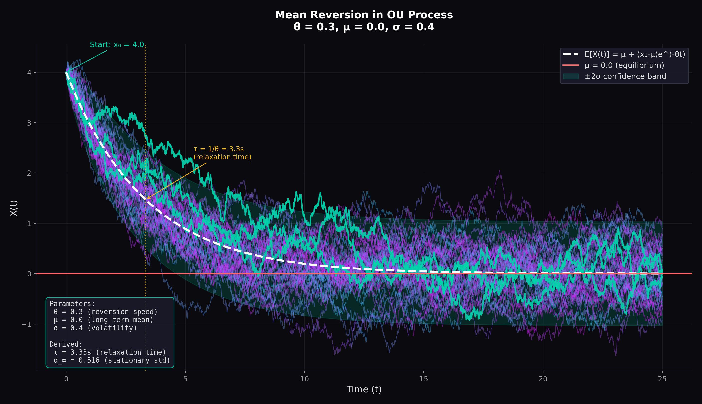
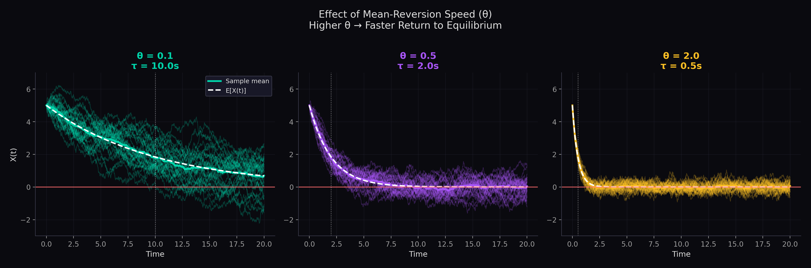
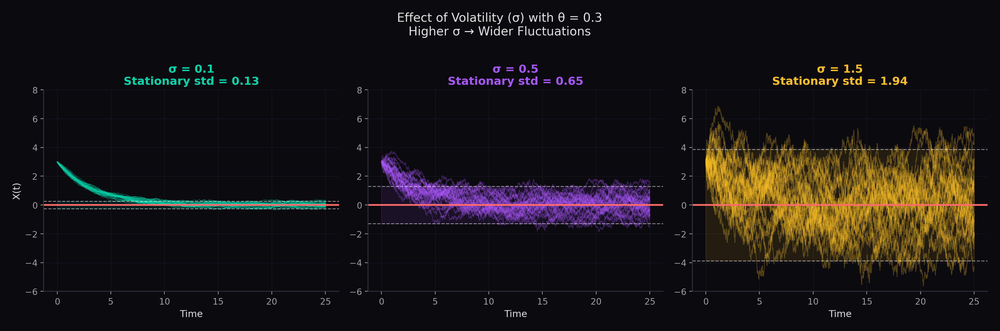
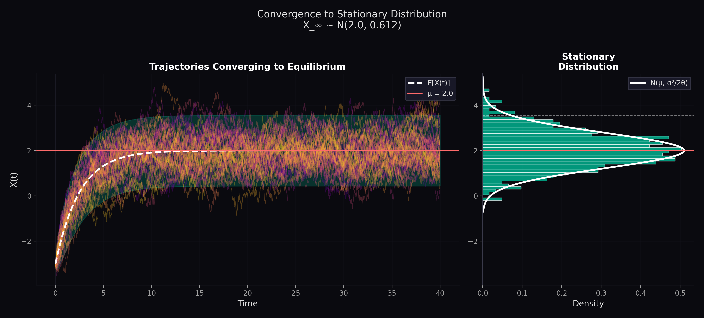
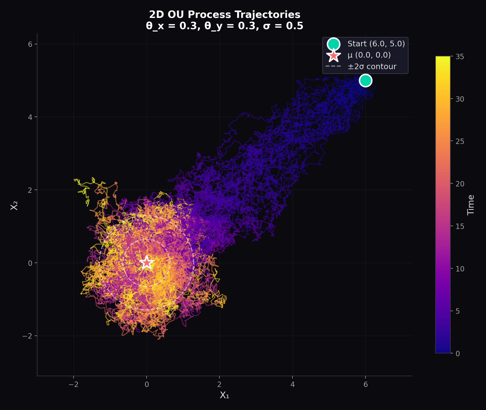
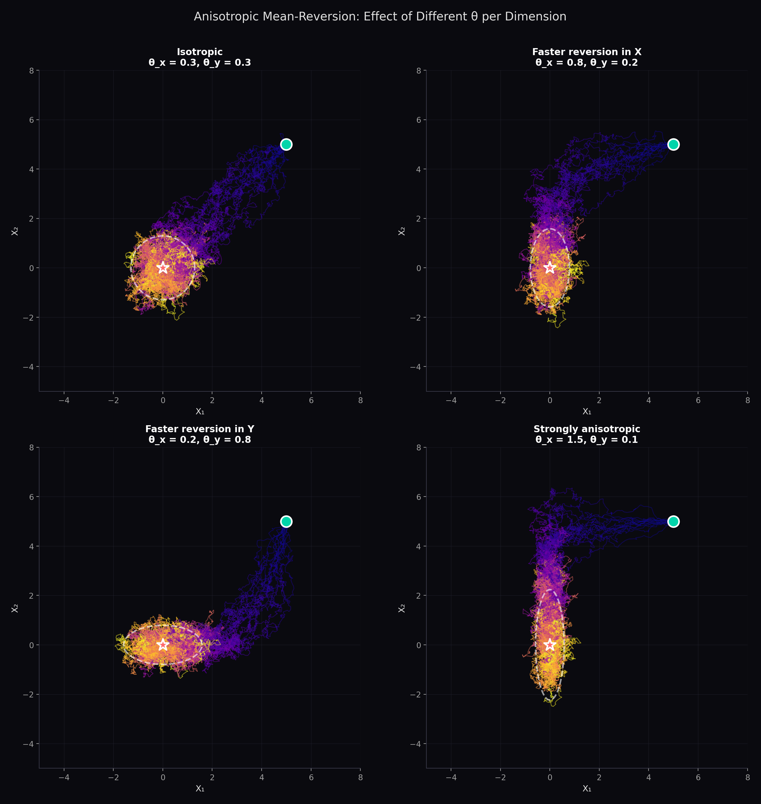

# Understanding the Ornstein-Uhlenbeck Process

A clean, visual introduction to the Ornstein-Uhlenbeck (OU) process for understanding mean-reverting stochastic dynamics. Built for those exploring quantitative finance, statistical physics, or stochastic calculus.

<p align="center">
  
</p>

## What is the OU Process?

The Ornstein-Uhlenbeck process models a particle connected to equilibrium by a "spring" while being buffeted by random noise. It's the simplest continuous-time mean-reverting process:

$$dX_t = \theta(\mu - X_t)dt + \sigma dW_t$$

where:
| Parameter | Meaning | Intuition |
|-----------|---------|-----------|
| $\theta$ | Mean-reversion speed | How fast the spring pulls back |
| $\mu$ | Long-term mean | Equilibrium position |
| $\sigma$ | Volatility | Noise intensity |
| $W_t$ | Wiener process | Random Brownian kicks |

**Think of it as:** A drunk person on a rubber band, always pulled toward home but constantly stumbling.

## Quick Start

```bash
git clone https://github.com/yourusername/ou-process-tutorial.git
cd ou-process-tutorial
pip install -r requirements.txt
python run_demo.py
```

## Core Intuitions

### 1. Mean Reversion

Unlike Brownian motion which wanders forever, the OU process always returns to $\mu$:

<p align="center">
  
</p>

The expected value decays exponentially:
$$\mathbb{E}[X_t] = \mu + (x_0 - \mu)e^{-\theta t}$$

### 2. Relaxation Time ($\tau = 1/\theta$)

The **relaxation time** tells you how fast the process "forgets" its initial condition:

<p align="center">
  
</p>

| $\theta$ | $\tau = 1/\theta$ | Behavior |
|----------|-------------------|----------|
| 0.1 | 10s | Slow, lazy reversion |
| 0.5 | 2s | Moderate |
| 2.0 | 0.5s | Snaps back quickly |

### 3. Volatility Effect ($\sigma$)

Higher volatility = wider fluctuations around equilibrium:

<p align="center">
  
</p>

The stationary variance is:
$$\text{Var}(X_\infty) = \frac{\sigma^2}{2\theta}$$

This creates a fundamental tradeoff: strong mean-reversion ($\large\theta$) fights volatility ($\sigma$).

### 4. Stationary Distribution

After long time, the process forgets where it started and settles into a Gaussian:

$$X_\infty \sim \mathcal{N}\left(\mu, \frac{\sigma^2}{2\theta}\right)$$

<p align="center">
  
</p>

### 5. Two-Dimensional Dynamics

In 2D, the mean-reversion matrix $A$ controls the "spring stiffness" in each direction:

<p align="center">
  
</p>

### 6. Anisotropic Behavior

When eigenvalues of $A$ differ, the process has directional preferences:

<p align="center">
  
</p>

The elliptical contours reveal the stationary covariance structure.

## Key Formulas

| Property | Formula | Description |
|----------|---------|-------------|
| Expected value | $\mathbb{E}[X_t] = \mu + (x_0 - \mu)e^{-\theta t}$ | Exponential decay to $\mu$ |
| Variance | $\text{Var}(X_t) = \frac{\sigma^2}{2\theta}(1 - e^{-2\theta t})$ | Grows then saturates |
| Relaxation time | $\tau = 1/\theta$ | Time to decay by factor $e$ |
| Stationary variance | $\sigma_\infty^2 = \sigma^2 / 2\theta$ | Long-term fluctuation scale |
| Autocorrelation | $\rho(s) = e^{-\theta \lvert s \rvert}$ | Exponential decay |

## Applications

**Quantitative Finance**
- **Vasicek Model**: $dr_t = a(b - r_t)dt + \sigma dW_t$ — the OU process for interest rates
- **Pairs Trading**: If spread $S_t$ between two assets is OU, you can compute optimal entry/exit thresholds
- **Mean-Reverting Volatility**: Many vol models assume $\sigma_t$ follows OU dynamics
- **Parameter Estimation**: Given time series data, estimate $\theta$, $\mu$, $\sigma$ via MLE or method of moments

**Physics**
- Brownian motion in a harmonic trap
- Thermal fluctuations
- Langevin dynamics

**Biology**
- Gene expression noise
- Neural membrane potentials
- Population dynamics near carrying capacity

## Code Structure

```
ou-process-tutorial/
├── ou_process.py      # Core simulation & theory
├── visualizations.py  # All plotting functions
├── run_demo.py        # Generate all figures
├── requirements.txt   # Dependencies
└── figures/           # Output directory
```

## API Reference

### Simulation

```python
from ou_process import simulate_ou_1d, simulate_ou_2d

# 1D simulation
t, X = simulate_ou_1d(
    theta=0.5,    # mean-reversion speed
    mu=0.0,       # long-term mean
    sigma=0.3,    # volatility
    x0=3.0,       # initial position
    T=20.0,       # total time
    n_paths=100   # number of trajectories
)

# 2D simulation with anisotropic reversion
A = np.diag([0.5, 0.2])  # different speeds per dimension
t, X = simulate_ou_2d(A, mu=np.array([0, 0]), sigma=0.5, x0=np.array([5, 5]))
```

### Theoretical Properties

```python
from ou_process import compute_ou_properties, theoretical_mean, theoretical_variance

props = compute_ou_properties(theta=0.5, mu=0.0, sigma=0.3)
print(f"Relaxation time: {props.relaxation_time}")
print(f"Stationary std: {props.stationary_std}")
```

### Visualization

```python
from visualizations import (
    plot_mean_reversion_demo,
    plot_theta_comparison,
    plot_2d_trajectories,
    plot_anisotropic_comparison
)

plot_mean_reversion_demo(theta=0.5, mu=0, sigma=0.3, save_path='my_plot.png')
```

## Extensions & Further Reading

**Beyond this tutorial:**
- Multi-dimensional OU with correlated noise
- Parameter estimation (MLE, method of moments)
- OU as solution to Langevin equation
- Fractional OU process (long memory)
- Jump-diffusion extensions

**References:**
- Øksendal, [*Stochastic Differential Equations An Introduction with Applications*](https://link.springer.com/book/10.1007/978-3-642-14394-6) (4th ed.), Springer
- Jeanblanc , Yor , Chesney, [*Mathematical Methods for Financial Markets*](https://link.springer.com/book/10.1007/978-1-84628-737-4), Springer


## License

MIT License — see LICENSE file.

---

*Built for learning. Star ⭐ if helpful!*
